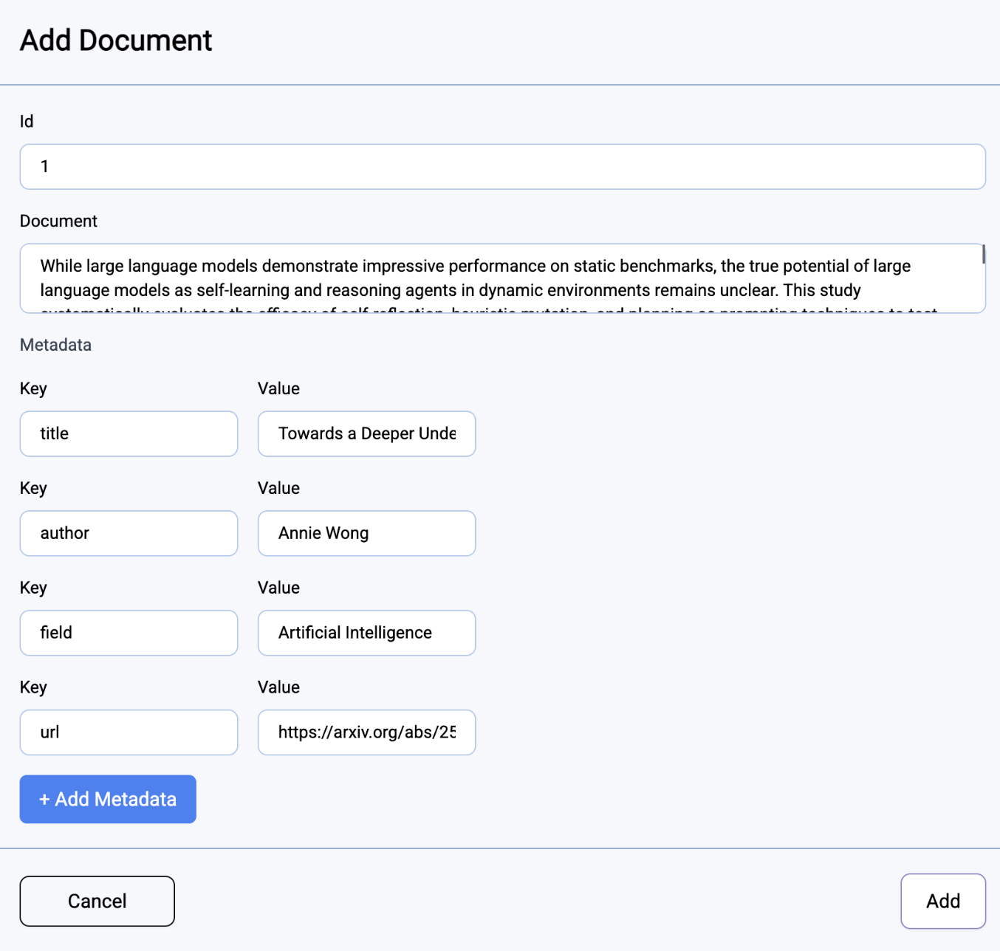
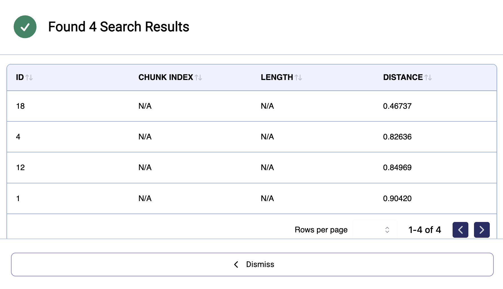

Finding the right research paper can be frustrating. You might know what you're looking for, but if you don’t use the exact words the paper uses, it won’t show up. This makes it hard to discover useful studies, especially when different authors describe the same idea in different ways.

In this post, we’ll build a simple but powerful **semantic search tool** for scientific paper abstracts. Instead of relying on exact keywords, our system will understand the meaning behind your query and return papers that match — even if the words are different.

We'll also add filters so you can narrow results by author or field. In the end, you'll have a better way to search research papers using both meaning and metadata.

## Setting Up the Environment

Before we can start inserting and querying data, we need to spin up a ChromaDB runtime instance. This gives us a dedicated environment with access to the vector database and the necessary compute resources.

I created a new ChromaDB runtime instance through the <SiteName/> platform. When creating the instance, I selected the following configuration:

-   **Model**: `gemma3:27b` – a lightweight embedding model suitable for semantic tasks
-   **CPU Type**: `n1-standard-4` – a balanced general-purpose machine
-   **GPU Type**: `nvidia-tesla-t4`
-   **GPU Count**: `2` – to support faster embedding generation and query performance

Once launched, the runtime takes a short time to initialize. After the runtime is ready, we can move on to inserting the scientific abstracts into the vector database.

:::note
Depending on your use case, you may want to choose a different database or runtime configuration. For example, if you need to store millions of documents or perform large-scale inference, you might need more memory, different embedding models, or a more scalable database backend.
:::

## Inserting Scientific Abstracts

Now that the environment is set up, we can start adding real data to the vector database. Each document we insert includes two parts: the **content**, which is the text we want to embed (in this case, the paper’s abstract), and the **metadata**, which contains useful structured information such as the paper’s title, author, research field, and a link to the full paper.

```json
{
	"id": "1",
	"content": "Understanding an agent's intent through its behavior...",
	"metadata": {
		"title": "General Dynamic Goal Recognition",
		"authors": ["Osher Elhadad"],
		"field": "Artificial Intelligence",
		"url": "https://arxiv.org/abs/2505.09737"
	}
}
```

There are several ways to insert data into ChromaDB via <SiteName/> — using the **<SiteName/> dashboard**, the **CLI**, or the **API**. Since this isn’t a production setup, I’ll use the dashboard for simplicity. The graphical interface makes uploading and managing documents straightforward.

For this example, I’ll add 20 documents related to the **Artificial Intelligence** field. This will give us enough material to demonstrate how semantic search works in practice, including finding relevant papers by topic and exploring related results.

Bellow you can see how one document gets added to the database:



## Querying: Searching with Semantics + Filters

Now that our documents are in the database, we can start searching using natural language. Instead of looking for exact keyword matches, semantic search finds documents that are similar in meaning, even if they use different words than the query.

There are multiple ways to run a search query. In a production setup, you’d likely use a more programmatic approach — through the <SiteName/> API or CLI. But for testing purposes, I’ll use the <SiteName/> dashboard. It offers a simple interface where I can enter a natural language query like “how to recognize agent goals from behavior”, and it will return the most relevant documents based on the meaning of the query.

And sure enough, here are the results from the query:



What’s even cooler is that you can add filters based on the metadata we included with each document. For example, you can filter results by author — so if you’re only interested in papers written by a specific person, you can apply that filter alongside your query to see only their work that's relevant to your search.

## Conclusion

In this post, we built a simple but powerful search tool for scientific abstracts. Instead of just matching keywords, our system understands the meaning behind a query and shows more relevant results.

Using <SiteName/>, we created a runtime, added documents with helpful metadata, and ran natural language searches — even with filters like author or topic. This makes it much easier to find the papers you’re actually looking for.

While we focused on scientific abstracts, the same approach can be used for many other things — like searching through customer support tickets, internal documentation, meeting notes, legal texts, or even product reviews. Anywhere there's text and structure, semantic search with metadata filters can make finding the right information faster and smarter.

There’s still a lot more you could build from here, but even this small project shows how useful vector search can be in real-world situations.
